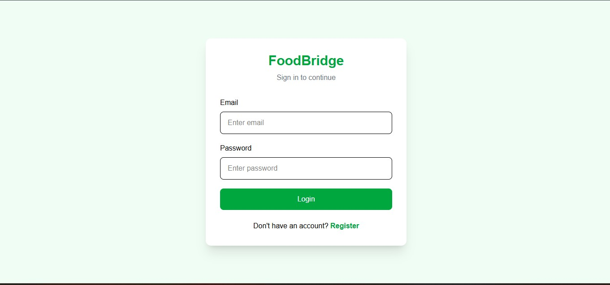
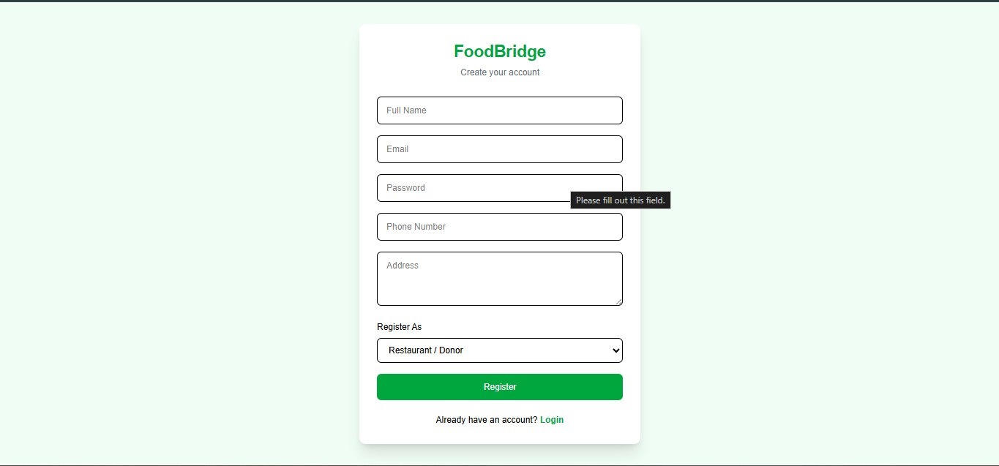
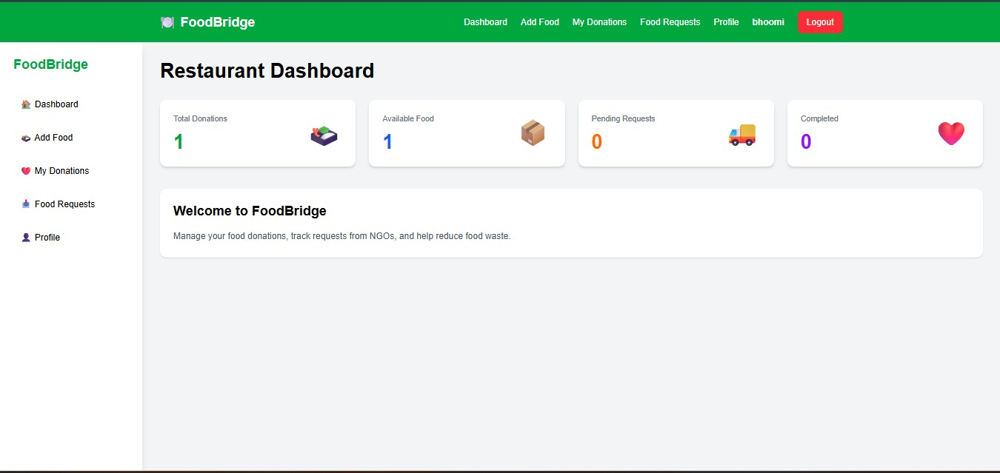
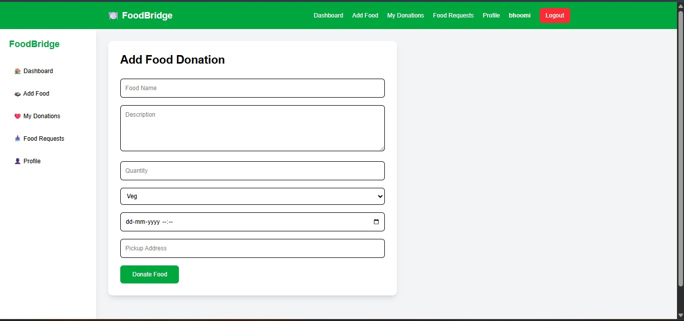
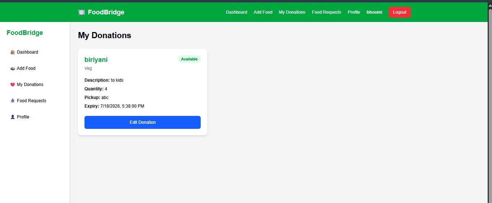
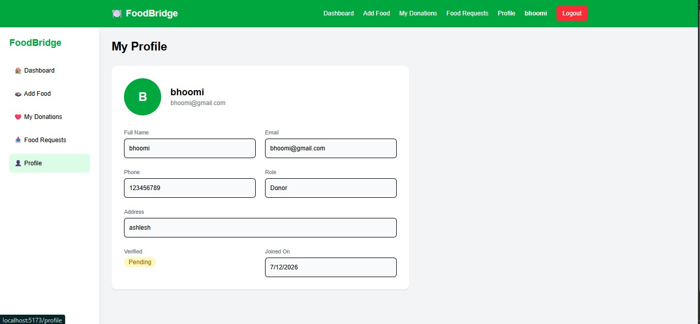

# 🍽️ FoodBridge - Food Donation Platform

> A full-stack MERN application that connects restaurants with NGOs to reduce food waste by enabling seamless food donation and request management.

---

## 📌 Overview

FoodBridge is a web-based platform designed to bridge the gap between food donors and NGOs. Restaurants can donate surplus food, while NGOs can browse available donations and request food for distribution to those in need.

The platform provides secure authentication, role-based access control, real-time request management, and intuitive dashboards for both donors and NGOs.

---

# 🚀 Features

## 🔐 Authentication
- JWT Authentication
- Secure Login & Registration
- Password Encryption using bcrypt
- Role-Based Authorization

## 🍱 Restaurant Features
- Add Food Donations
- View My Donations
- Manage NGO Requests
- Accept / Reject Requests
- Dashboard Analytics
- Profile Management

## 🤝 NGO Features
- Browse Available Food
- Request Food Donations
- Track Request Status
- Dashboard
- Profile Management

## 📊 Dashboard
- Total Donations
- Available Food
- Pending Requests
- Completed Donations

---

# 🛠 Tech Stack

## Frontend
- React.js
- Vite
- Tailwind CSS
- React Router DOM
- Axios

## Backend
- Node.js
- Express.js
- MongoDB
- Mongoose
- JWT Authentication
- bcrypt.js

## Database
- MongoDB Atlas

---

# 📂 Project Structure

```
FoodBridge
│
├── client
│   ├── components
│   ├── pages
│   ├── services
│   ├── context
│   └── App.jsx
│
├── server
│   ├── controllers
│   ├── middleware
│   ├── models
│   ├── routes
│   ├── config
│   └── server.js
│
└── README.md
```

---

# 📸 Screenshots

## Login



---

## Register



---

## Restaurant Dashboard



---

## Add Food



---

## Browse Food


---

## My Donations



---

## My Requests


---

## Restaurant Requests


---

## Profile



---

# ⚙ Installation

## Clone Repository

```bash
git clone https://github.com/bhoomikaupadhyaya/Foodbridge.git
```

### Backend

```bash
cd server
npm install
npm run dev
```

### Frontend

```bash
cd client
npm install
npm run dev
```

---

# Environment Variables

Create `.env`

```
PORT=5000
MONGO_URI=your_mongodb_connection
JWT_SECRET=your_secret_key
```

---

# Future Enhancements

- Google Maps Integration
- Email Notifications
- Cloudinary Image Upload
- Admin Dashboard
- Analytics Charts
- Real-Time Notifications

---

# 👩‍💻 Author

**Bhoomika Upadhyaya**

GitHub:
https://github.com/bhoomikaupadhyaya

LinkedIn:
https://www.linkedin.com/in/bhoomika-upadhyaya

---

⭐ If you like this project, consider giving it a star.
